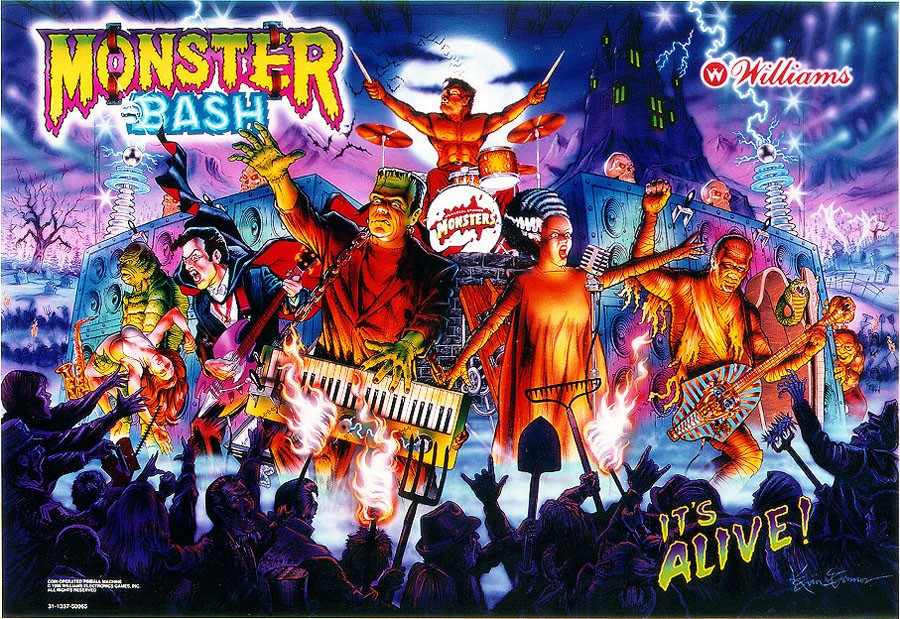

# Claude Code Monster Bash Sound Effects



Turn your [Claude Code](https://docs.anthropic.com/en/docs/claude-code) sessions into a Monster Bash pinball session with iconic sound effects on every hook event.

> **macOS only** — uses `afplay` for audio playback.

## Sound Mapping

| Hook | Sound | When |
|---|---|---|
| `SessionStart` | `Dracula_-_Welcome_to_the_Monster_Bash.mp3` | "Welcome to the Monster Bash" — session starts |
| `SessionEnd` | `Bride_of_Frankenstein_-_Noooo.mp3` | "Noooo" — session ends |
| `Stop` | `Bride_of_Frankenstein_-_Get_your_grubby_paws_off_me.mp3` | "Get your grubby paws off me" — task completed |
| `PostToolUse` (AskUserQuestion) | `Dracula_-_Get_on_your_feet_and_jam.mp3` | "Get on your feet and jam!" — Claude asks you a question |
| `PostToolUse` (ExitPlanMode) | `Dracula_-_Form_the_moshpit.mp3` | "Form the moshpit" — plan finalized |
| `Elicitation` | `Dracula_-_Over_here_garlic_bread.mp3` | "Over here, garlic bread" — form displayed |
| `PostToolUseFailure` | `Dracula_-_Ow.mp3` | "Ow" — a tool call fails |
| `SubagentStart` | `Dracula_-_Lets_rock.mp3` | "Let's rock!" — subagent launched |
| `SubagentStop` | `Wolfman_-_Im_outta_here.mp3` | "I'm outta here" — subagent finished |
| `PermissionRequest` | `Mummy_-_I_wanna_jam.mp3` | "I wanna jam!" — permission requested |
| `UserPromptSubmit` | `Doctor_-_Get_ready_while_I_flip_the_switch.mp3` | "Get ready while I flip the switch!" — you send a message |
| `TaskCompleted` | `Dracula_-_Jackpot.mp3` | "Jackpot!" — background task completed |

## Installation

```bash
git clone git@github.com:w3cdotorg/claude-monster-bash-sounds.git
cd claude-monster-bash-sounds
./install.sh
```

The installer will:
1. Copy all `.wav` files to `~/.claude/sounds/`
2. Add the hooks configuration to `~/.claude/settings.json`

If you already have hooks configured, it will save the new hooks to `hooks.json` for you to merge manually.

Restart Claude Code after installation.

## Uninstall

```bash
./uninstall.sh
```

## Manual Installation

If you prefer to configure manually without running the install script:

**1. Copy the sounds**

```bash
mkdir -p ~/.claude/sounds
cp sounds/*.wav ~/.claude/sounds/
```

**2. Edit your Claude Code settings**

Open (or create) `~/.claude/settings.json` and add the `hooks` key from [`hooks-reference.json`](hooks-reference.json):

```json
{
  "hooks": {
    "SessionStart": [
      { "hooks": [{ "type": "command", "command": "afplay ~/.claude/sounds/Dracula_-_Welcome_to_the_Monster_Bash.mp3 &" }] }
    ],
    "SessionEnd": [
      { "hooks": [{ "type": "command", "command": "afplay ~/.claude/sounds/Bride_of_Frankenstein_-_Noooo.mp3 &" }] }
    ],
    "Stop": [
      { "hooks": [{ "type": "command", "command": "afplay ~/.claude/sounds/Bride_of_Frankenstein_-_Get_your_grubby_paws_off_me.mp3 &" }] }
    ],
    "PostToolUse": [
      { "matcher": "AskUserQuestion", "hooks": [{ "type": "command", "command": "afplay ~/.claude/sounds/Dracula_-_Get_on_your_feet_and_jam.mp3 &" }] },
      { "matcher": "ExitPlanMode", "hooks": [{ "type": "command", "command": "afplay ~/.claude/sounds/Dracula_-_Form_the_moshpit.mp3 &" }] }
    ],
    "Elicitation": [
      { "hooks": [{ "type": "command", "command": "afplay ~/.claude/sounds/Dracula_-_Over_here_garlic_bread.mp3 &" }] }
    ],
    "PostToolUseFailure": [
      { "hooks": [{ "type": "command", "command": "afplay ~/.claude/sounds/Dracula_-_Ow.mp3 &" }] }
    ],
    "SubagentStart": [
      { "hooks": [{ "type": "command", "command": "afplay ~/.claude/sounds/Dracula_-_Lets_rock.mp3 &" }] }
    ],
    "SubagentStop": [
      { "hooks": [{ "type": "command", "command": "afplay ~/.claude/sounds/Wolfman_-_Im_outta_here.mp3 &" }] }
    ],
    "PermissionRequest": [
      { "hooks": [{ "type": "command", "command": "afplay ~/.claude/sounds/Mummy_-_I_wanna_jam.mp3 &" }] }
    ],
    "UserPromptSubmit": [
      { "hooks": [{ "type": "command", "command": "afplay ~/.claude/sounds/Doctor_-_Get_ready_while_I_flip_the_switch.mp3 &" }] }
    ],
    "TaskCompleted": [
      { "hooks": [{ "type": "command", "command": "afplay ~/.claude/sounds/Dracula_-_Jackpot.mp3 &" }] }
    ]
  }
}
```

> If you already have a `settings.json` with other keys (`enabledPlugins`, etc.), merge the `hooks` section into your existing file.

**3. Restart Claude Code**

## Customization

269 Monster Bash pinball sounds are included in the `sounds/` directory. Feel free to swap any sound by editing `~/.claude/settings.json` and changing the filename.

## Requirements

- macOS (uses `afplay`)
- [Claude Code](https://docs.anthropic.com/en/docs/claude-code) CLI

## License

MIT
